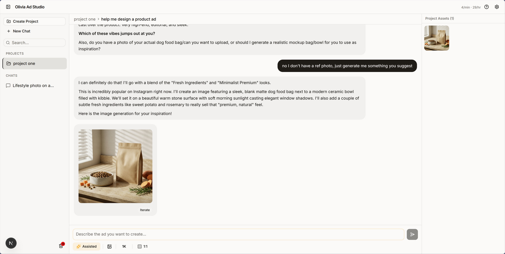
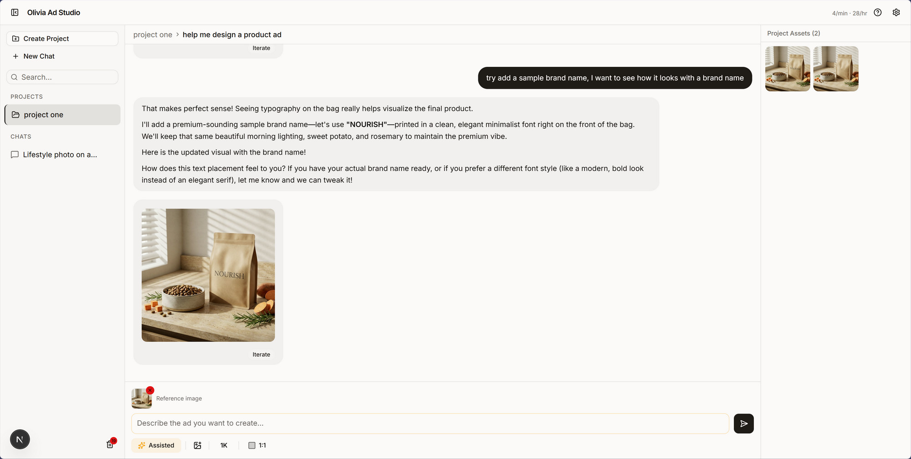

# Olivia Ad Studio

AI-powered product ad generator. Upload a product image, describe your vision, and generate professional ad creatives through conversation.

## Screenshots

| Assisted Mode — Generating an ad | Iterating with brand name |
|---|---|
|  |  |

## Features

- **Two Generation Modes** — *Assisted* mode with an AI creative director that asks clarifying questions, or *Generate* mode for direct image generation
- **AI Image Generation** — Powered by Nano Banana Pro for studio-quality visuals up to 4K
- **Iterative Editing** — Click "Iterate" on any image to use it as a reference, then describe changes
- **Resolution & Aspect Ratios** — 1K, 2K, or 4K resolution with 10 aspect ratios from 1:1 to 21:9
- **Projects & Chats** — Organize work into projects or standalone chats with full conversation history
- **Agentic Behavior** — Auto-detects product type, suggests ad directions, improves prompts
- **Asset Gallery** — Browse all generated images with a full-screen lightbox viewer
- **Trash Bin** — Soft-delete conversations with restore or permanent delete
- **Search** — Find conversations by title across projects and chats
- **Dark/Light/System Theme** — No flash on page load
- **Custom API Key** — Bring your own Gemini API key or use the default
- **Fully Local** — All data stored in your browser (localStorage + IndexedDB)
- **URL State** — Refresh the page and stay where you were
- **Rate Limiting** — Client-side throttling to protect API budget (5/min, 30/hr)

## Tech Stack

| Layer | Technology |
|-------|-----------|
| Framework | Next.js 16 (App Router, TypeScript) |
| UI | Shadcn UI v4 + Tailwind CSS v4 |
| Chat AI | Gemini 3.1 Pro Preview |
| Image AI | Nano Banana Pro (`gemini-3-pro-image-preview`) |
| Theming | next-themes |
| Storage | localStorage + IndexedDB (idb-keyval) |
| Testing | Vitest + React Testing Library |
| Package Manager | pnpm |
| Deployment | Vercel |

## Getting Started

### Prerequisites

- Node.js 18+
- pnpm
- Gemini API key ([Get one here](https://aistudio.google.com/apikey))

### Setup

```bash
# Clone the repo
git clone https://github.com/thangk/olivia-app.git
cd olivia-app

# Install dependencies
pnpm install

# Set up environment variables
cp .env.example .env.local
# Add your GEMINI_API_KEY to .env.local

# Start dev server
pnpm dev
```

Open [http://localhost:3000](http://localhost:3000).

### Environment Variables

| Variable | Description | Required |
|----------|-------------|----------|
| `GEMINI_API_KEY` | Default Gemini API key for all users | Yes |

Users can also enter their own API key in Settings to use instead of the default.

## Project Structure

```
src/
├── app/                  # Next.js App Router
│   ├── api/gemini/       # API routes (chat + image generation)
│   ├── layout.tsx        # Root layout with theme provider
│   └── page.tsx          # Main workspace page
├── components/
│   ├── ui/               # Shadcn components
│   ├── layout/           # App layout (sidebar, panels, breadcrumbs)
│   ├── chat/             # Messages, input, suggestions, mode selector
│   ├── canvas/           # Asset gallery, lightbox, ratio/resolution controls
│   ├── settings/         # Settings + features dialogs
│   └── theme/            # Theme provider
├── hooks/                # Custom React hooks (chat, canvas, conversations, settings)
├── lib/                  # Utilities (Gemini client, storage, image utils, rate limit)
└── types/                # TypeScript interfaces
```

## Development

```bash
pnpm dev          # Start dev server (Turbopack)
pnpm build        # Production build
pnpm test:run     # Run tests once
pnpm test         # Run tests in watch mode
pnpm lint         # Lint code
```

### Git Workflow

```
dev → PR → staging (Devin Review) → PR → main (Vercel deploy)
```

## Deployment

Deployed on [Vercel](https://vercel.com). Auto-deploys on push to `main`.

## License

MIT
